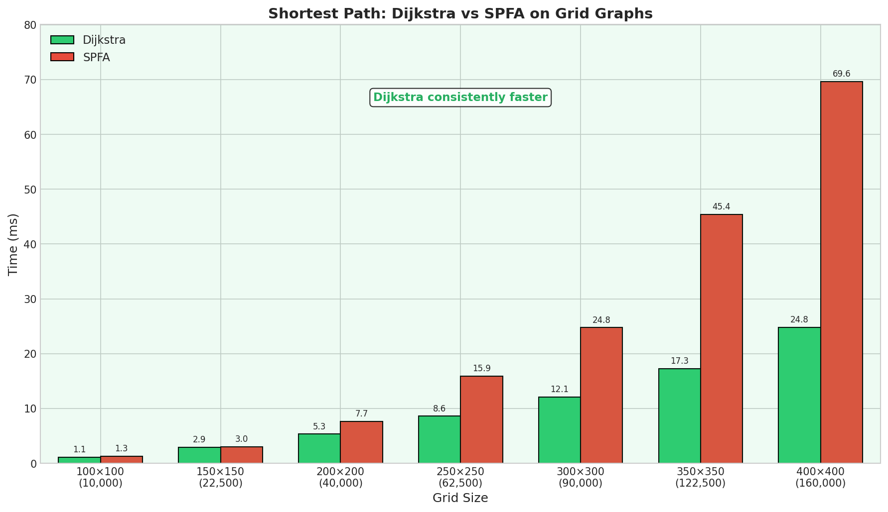
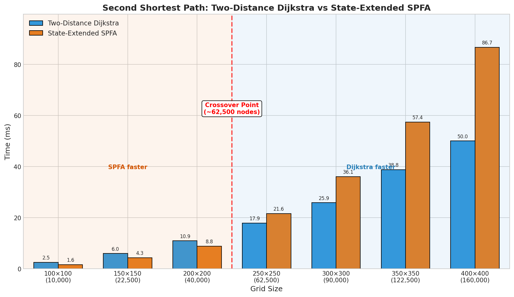
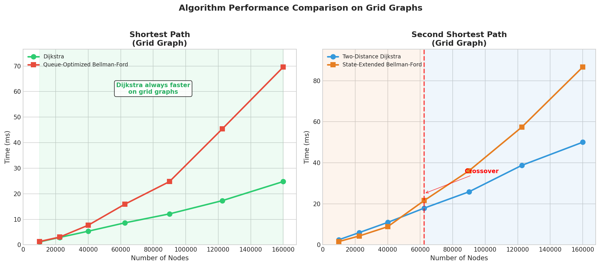
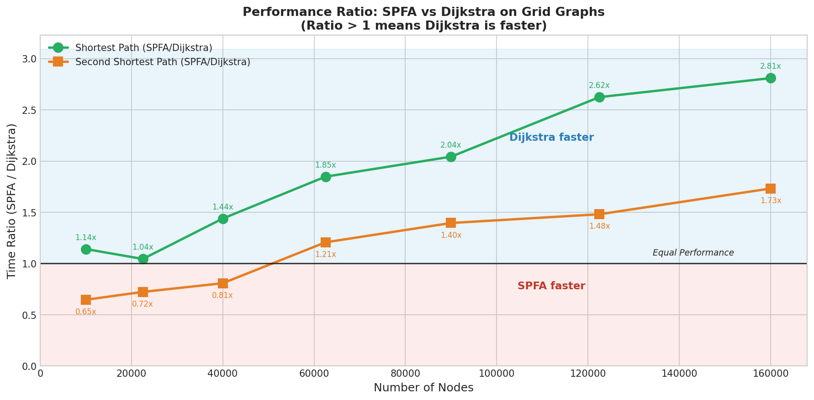

# Benchmark: Dijkstra vs SPFA on Grid Graphs

This document presents a comprehensive benchmark comparing **Dijkstra** and **SPFA** algorithms for both **shortest path** and **second shortest path** problems on grid graphs.

## Table of Contents

- [Overview](#overview)
- [Algorithms](#algorithms)
- [Experimental Setup](#experimental-setup)
- [Results](#results)
  - [Shortest Path](#shortest-path)
  - [Second Shortest Path](#second-shortest-path)
  - [Combined Analysis](#combined-analysis)
- [Key Findings](#key-findings)
- [How to Run](#how-to-run)

## Overview

Grid graphs are known to be adversarial cases for SPFA (Shortest Path Faster Algorithm). This benchmark investigates:

1. **Shortest Path Problem**: Does SPFA degrade on grid graphs as expected?
2. **Second Shortest Path Problem**: Does the same pattern hold for second shortest path algorithms?

### Why Grid Graphs?

Grid graphs have unique properties that stress-test SPFA:

- **Large diameter**: The shortest path from top-left to bottom-right requires `H + W` hops
- **Many alternative paths**: Numerous paths exist between any two nodes
- **Cascading updates**: When a node's distance is updated, the change propagates through long chains of neighbors

These properties cause SPFA to repeatedly re-enqueue nodes, degrading its performance from the expected O(kM) to worst-case O(NM).

## Algorithms

### Shortest Path

| Algorithm | Data Structure | Time Complexity |
|-----------|---------------|-----------------|
| **Dijkstra** | Min-heap (priority queue) | O(M log N) |
| **SPFA** | FIFO queue | O(kM) average, O(NM) worst |

### Second Shortest Path

| Algorithm | Data Structure | Time Complexity |
|-----------|---------------|-----------------|
| **Two-Distance Dijkstra** | Min-heap maintaining (d1, d2) | O(M log N) |
| **State-Extended SPFA** | FIFO queue maintaining (d1, d2) | O(kM) average, O(NM) worst |

The second shortest path algorithms maintain two distances for each node:
- `d1[v]`: Shortest distance from source to v
- `d2[v]`: Second shortest distance from source to v (strictly greater than d1)

## Experimental Setup

### Test Environment

- **Graph Type**: Grid graphs (undirected)
- **Edge Weights**: Random integers in [1, 10]
- **Source**: Node 1 (top-left corner)
- **Target**: Node N (bottom-right corner)

### Grid Sizes Tested

| Grid Size | Nodes | Edges |
|-----------|-------|-------|
| 100 × 100 | 10,000 | 19,800 |
| 150 × 150 | 22,500 | 44,700 |
| 200 × 200 | 40,000 | 79,600 |
| 250 × 250 | 62,500 | 124,500 |
| 300 × 300 | 90,000 | 179,400 |
| 350 × 350 | 122,500 | 244,300 |
| 400 × 400 | 160,000 | 319,200 |

## Results

### Shortest Path



**Observation**: Dijkstra consistently outperforms SPFA on grid graphs across all tested sizes.

| Grid Size | Dijkstra (ms) | SPFA (ms) | Winner | Speedup |
|-----------|---------------|-----------|--------|---------|
| 100 × 100 | 1.13 | 1.29 | Dijkstra | 1.14× |
| 150 × 150 | 2.91 | 3.04 | Dijkstra | 1.05× |
| 200 × 200 | 5.33 | 7.67 | Dijkstra | 1.44× |
| 250 × 250 | 8.60 | 15.89 | Dijkstra | 1.85× |
| 300 × 300 | 12.12 | 24.76 | Dijkstra | 2.04× |
| 350 × 350 | 17.30 | 45.40 | Dijkstra | 2.62× |
| 400 × 400 | 24.78 | 69.62 | Dijkstra | **2.81×** |

**Key Insight**: The performance gap widens as grid size increases. SPFA's enqueue count explodes (up to 10× more than Dijkstra at 400×400), causing severe performance degradation.

### Second Shortest Path



**Observation**: Unlike the shortest path case, there is a **crossover point** where the winner changes.

| Grid Size | Dijkstra (ms) | SPFA (ms) | Winner | Ratio |
|-----------|---------------|-----------|--------|-------|
| 100 × 100 | 2.49 | 1.61 | **SPFA** | 0.65× |
| 150 × 150 | 5.96 | 4.31 | **SPFA** | 0.72× |
| 200 × 200 | 10.93 | 8.83 | **SPFA** | 0.81× |
| **250 × 250** | **17.90** | **21.61** | **Dijkstra** | 1.21× |
| 300 × 300 | 25.85 | 36.08 | Dijkstra | 1.40× |
| 350 × 350 | 38.75 | 57.39 | Dijkstra | 1.48× |
| 400 × 400 | 50.03 | 86.68 | Dijkstra | **1.73×** |

**Crossover Point**: Around **62,500 nodes** (250 × 250 grid)

- Below this threshold: SPFA is faster
- Above this threshold: Dijkstra is faster

### Combined Analysis



The side-by-side comparison reveals a striking difference:

| Problem | SPFA Advantage Region | Dijkstra Advantage Region |
|---------|----------------------|--------------------------|
| Shortest Path | None (Dijkstra always wins) | All grid sizes |
| Second Shortest Path | < 62,500 nodes | > 62,500 nodes |

### Performance Ratio Trends



This chart shows the ratio of SPFA time to Dijkstra time:
- **Ratio > 1**: Dijkstra is faster
- **Ratio < 1**: SPFA is faster

**Observations**:

1. **Shortest Path** (green line): The ratio steadily increases from 1.14× to 2.81×, confirming Dijkstra's consistent advantage.

2. **Second Shortest Path** (orange line):
   - Starts below 1.0 (SPFA faster)
   - Crosses 1.0 at ~62,500 nodes
   - Continues to increase (Dijkstra faster)

## Key Findings

### 1. Grid Graphs Expose SPFA's Weakness

On grid graphs, SPFA's worst-case behavior is triggered:
- Enqueue operations grow super-linearly with graph size
- At 400×400, SPFA enqueues 10× more nodes than Dijkstra

### 2. Second Shortest Path Has Different Characteristics

The second shortest path problem shows a delayed crossover compared to shortest path:

| Metric | Shortest Path | Second Shortest Path |
|--------|---------------|---------------------|
| Crossover point | None (always Dijkstra) | ~62,500 nodes |
| Max Dijkstra speedup | 2.81× | 1.73× |

**Why?** The second shortest path requires maintaining two distances (d1, d2) per node:
- Dijkstra's heap operations become more expensive (more push/pop)
- SPFA's O(1) queue operations partially offset its re-enqueue overhead
- The crossover happens later because Dijkstra's per-operation cost is higher

### 3. Practical Recommendations

| Scenario | Recommended Algorithm |
|----------|----------------------|
| Shortest path on grid graphs | **Dijkstra** (always) |
| Second shortest path, small graphs (< 60K nodes) | **SPFA** |
| Second shortest path, large graphs (> 60K nodes) | **Dijkstra** |
| Sparse random graphs | SPFA (often faster) |
| Dense graphs | Dijkstra (more stable) |

## How to Run

### Prerequisites

- C++17 compatible compiler (g++ recommended)
- Python 3.8+ with matplotlib and numpy (for visualization)

### Running the Benchmarks

```bash
# Compile
g++ -std=c++17 -O2 shortest_benchmark.cpp -o shortest_benchmark
g++ -std=c++17 -O2 second_shortest_benchmark.cpp -o benchmark

# Run
./shortest_benchmark
./benchmark
```

### Generating Visualizations

```bash
# Using uv (recommended)
uv run python visualize_benchmark.py

# Or with standard Python
python visualize_benchmark.py
```

### Output Files

| File | Description |
|------|-------------|
| `shortest_benchmark.cpp` | Shortest path benchmark source |
| `second_shortest_benchmark.cpp` | Second shortest path benchmark source |
| `visualize_benchmark.py` | Visualization script |
| `shortest_path_benchmark.png` | Shortest path results chart |
| `second_shortest_path_benchmark.png` | Second shortest path results chart |
| `combined_benchmark.png` | Side-by-side comparison |
| `speedup_ratio.png` | Performance ratio trends |

## Conclusion

This benchmark demonstrates that:

1. **Grid graphs are adversarial for SPFA** - confirming theoretical expectations
2. **The second shortest path problem has unique performance characteristics** - SPFA maintains an advantage at smaller scales
3. **Algorithm selection should consider both problem type and graph size** - there is no universally "best" algorithm

The crossover point at ~62,500 nodes for second shortest path is a novel finding that highlights how problem complexity affects algorithm performance trade-offs.
