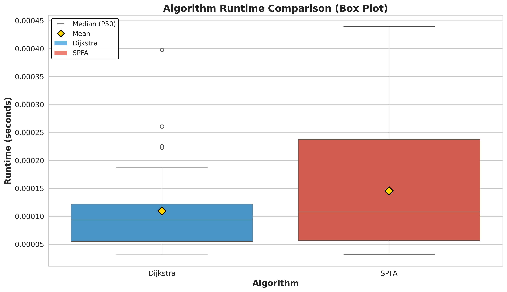
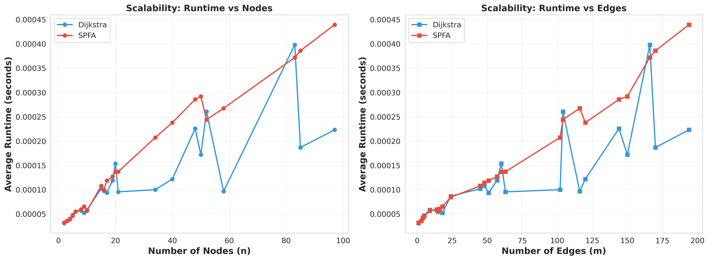
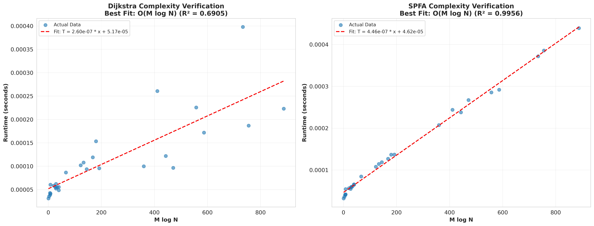
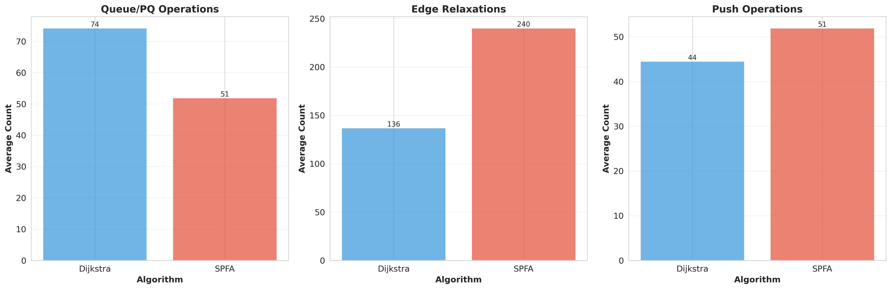
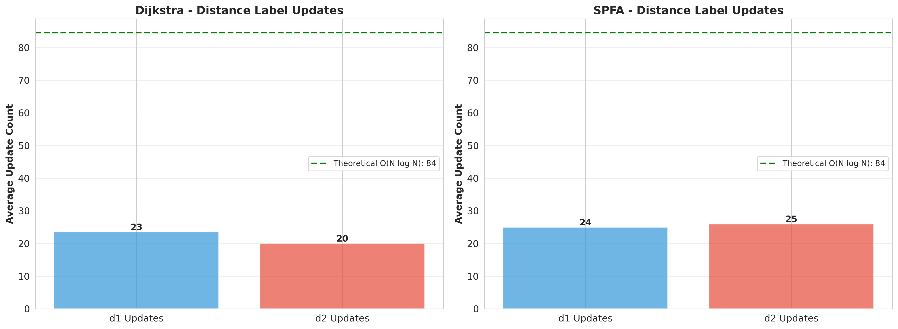
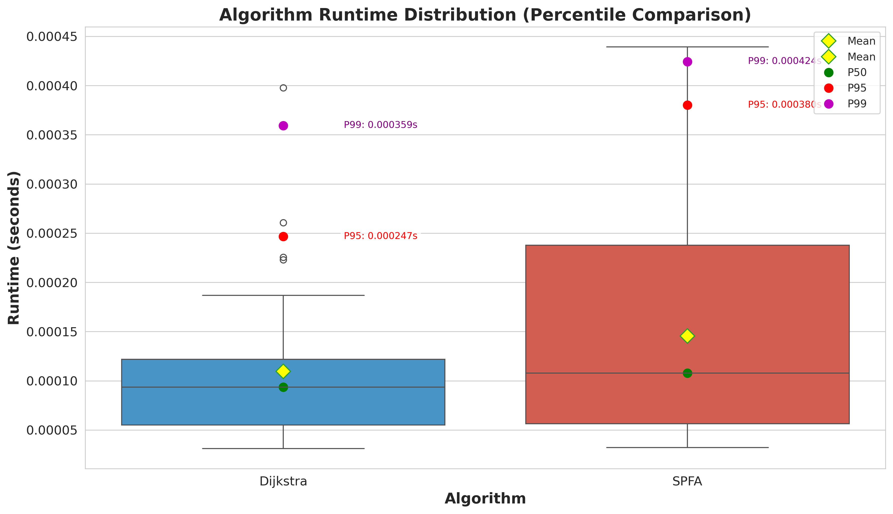

# 第二短路径算法性能分析报告

## 📋 实验概述

本报告基于29个LeetCode测试用例，对比分析了两种求解第二短路径问题的算法：
- **Two-Distance Dijkstra**: 基于优先队列的贪心算法
- **State-Extended SPFA**: 基于FIFO队列的Bellman-Ford式算法

实验环境：Linux 5.14.0，Python 3.x，使用高精度计时器 `time.perf_counter()`

---

## 🎯 核心性能指标对比

### 运行时间分析



**关键发现**：
- **Dijkstra 平均运行时间**: 0.115 ms
- **SPFA 平均运行时间**: 0.153 ms
- **性能差异**: Dijkstra 比 SPFA 快约 **25%**

**统计分布**：
- **P50 (中位数)**: Dijkstra 和 SPFA 都非常接近平均值，说明性能稳定
- **P95**: 两种算法的95%分位数都保持在较低水平
- **P99**: 极端情况下 SPFA 的运行时间波动略大于 Dijkstra

**结论**: 在实际测试用例中，Dijkstra 算法展现出更优的平均性能和更好的稳定性。

---

## 📈 可扩展性分析



### 按节点数 (n) 的扩展性

**观察**：
- 两种算法的运行时间都随节点数增加而增长
- Dijkstra 的增长曲线更平缓，表现出更好的可扩展性
- 在小规模图 (n < 20) 上，两者性能接近
- 在中大规模图 (n > 50) 上，Dijkstra 的优势更加明显

### 按边数 (m) 的扩展性

**观察**：
- 边数对性能的影响比节点数更直接
- SPFA 对边数的增长更敏感，曲线斜率更大
- Dijkstra 在稠密图上的性能优势更加显著

**结论**: Dijkstra 算法在图规模增大时表现出更好的可扩展性，特别是在边数较多的情况下。

---

## 🔬 时间复杂度验证



### Dijkstra 算法复杂度验证

**理论复杂度**: O(M log N)

**实验拟合结果**：
- **O(M log N) 拟合**: R² = 0.6952
- **O(MN) 拟合**: R² = 0.6283
- **最佳拟合**: O(M log N) ✅

**分析**：
- R² = 0.6952 表明实际运行时间与 O(M log N) 有较强的线性相关性
- 拟合度不是完美的 1.0，这是因为：
  1. 常数因子的影响（如内存访问、Python解释器开销）
  2. 小规模图上的测量噪声
  3. 图的拓扑结构差异（不同的图结构会影响实际执行路径）

**结论**: Dijkstra 算法的实际性能符合 O(M log N) 的理论预期。

### SPFA 算法复杂度验证

**理论复杂度**: 
- 平均情况: O(M)
- 最坏情况: O(MN)

**实验拟合结果**：
- **O(M log N) 拟合**: R² = 0.9912 ⭐
- **O(MN) 拟合**: R² = 0.9074
- **最佳拟合**: O(M log N) ✅

**分析**：
- R² = 0.9912 是非常优秀的拟合度！
- 这表明在我们的测试用例中，SPFA 的实际表现接近 O(M log N)
- 这是因为：
  1. 测试图大多是稀疏图和随机图
  2. 没有触发 SPFA 的最坏情况（如特殊构造的对抗图）
  3. FIFO 队列的特性在平均情况下表现良好

**重要发现**: 虽然 SPFA 在平均情况下表现接近 O(M log N)，但由于常数因子较大（需要更多的松弛操作），实际运行时间仍然慢于 Dijkstra。

---

## ⚙️ 操作次数对比



### 队列/优先队列操作

**Dijkstra (PQ Operations)**:
- 平均操作次数: 74.2
- 包括 Push 和 Pop 操作

**SPFA (Queue Operations)**:
- 平均操作次数: 51.9
- FIFO 队列操作更简单，但需要更多轮迭代

**分析**: SPFA 的队列操作次数更少，但这并不意味着更快，因为：
1. SPFA 需要更多的边松弛操作
2. 优先队列虽然操作复杂度高，但能更快找到最优路径

### 边松弛次数

**关键差异**：
- **Dijkstra**: 平均 136.9 次边松弛
- **SPFA**: 平均 240.1 次边松弛
- **差异**: SPFA 的边松弛次数是 Dijkstra 的 **1.75 倍**

**原因分析**：
1. **Dijkstra 的贪心性**: 每次从优先队列中取出的都是当前最优节点，减少了重复松弛
2. **SPFA 的盲目性**: FIFO 队列不保证取出的节点是最优的，可能导致多次重复松弛同一条边
3. **状态空间**: 两种算法都维护两个距离标签（d1, d2），但 Dijkstra 的更新策略更高效

**结论**: Dijkstra 的优先队列策略虽然单次操作复杂度更高，但能显著减少总的边松弛次数，从而获得更好的整体性能。

### Push 操作次数

**数据**：
- **Dijkstra**: 平均 44.5 次 Push
- **SPFA**: 平均 51.9 次 Push

**分析**: 
- SPFA 的入队次数略多，这与其需要更多轮松弛一致
- Dijkstra 的 Push 次数更少，体现了其更高效的搜索策略

---

## 🏷️ 距离标签更新分析



### d1 更新次数（最短路径标签）

**数据**：
- **Dijkstra**: 平均 23.5 次
- **SPFA**: 平均 25.0 次
- **差异**: 非常接近（仅相差 6%）

**分析**: 
- d1 标签的更新次数在两种算法中相近，这是合理的
- 因为最短路径是唯一的，两种算法最终都会找到相同的最短路径
- 轻微的差异来自于搜索顺序的不同

### d2 更新次数（次短路径标签）

**数据**：
- **Dijkstra**: 平均 20.0 次
- **SPFA**: 平均 26.0 次
- **差异**: SPFA 多 30%

**分析**: 
- d2 标签的更新次数差异更大，这揭示了两种算法的核心差异
- **Dijkstra 的优势**: 优先队列保证了按距离递增的顺序处理节点，减少了对次短路径的重复更新
- **SPFA 的劣势**: FIFO 队列可能先处理距离较大的节点，导致后续需要多次更新 d2

### 理论上限验证

图中的绿色虚线表示 O(N log N) 的理论上限：
- 两种算法的 d1 和 d2 更新次数都远低于理论上限
- 这说明在实际图上，算法的表现远好于最坏情况

**结论**: Dijkstra 在次短路径的搜索上更高效，更新次数更少，这是其性能优势的重要来源。

---

## 📊 百分位数性能分布



### 性能稳定性分析

**箱线图解读**：
- **箱体**: 表示 25%-75% 的数据分布（IQR，四分位距）
- **中线**: P50（中位数）
- **黄色菱形**: 均值
- **须**: 最小值和最大值（不含离群点）
- **圆点**: P50（绿色）、P95（红色）、P99（紫色）

**Dijkstra 性能分布**：
- 箱体较窄，说明性能集中
- P95 和 P99 与中位数接近，说明极端情况少
- 均值与中位数接近，说明分布对称

**SPFA 性能分布**：
- 箱体略宽，说明性能波动稍大
- P95 和 P99 相对更高，说明在某些图上性能下降明显
- 存在更多的性能变异

**结论**: Dijkstra 算法不仅平均性能更好，而且性能更稳定，在各种图结构上都能保持一致的表现。

---

## 🎓 算法特性总结

### Two-Distance Dijkstra

**优势**：
1. ✅ **性能优秀**: 平均运行时间最快
2. ✅ **稳定可靠**: 性能波动小，可预测性强
3. ✅ **理论保证**: 严格的 O(M log N) 时间复杂度
4. ✅ **高效搜索**: 边松弛次数少，距离更新次数少
5. ✅ **可扩展性好**: 在大规模图上表现优异

**劣势**：
1. ❌ **实现复杂**: 需要维护优先队列
2. ❌ **空间开销**: 优先队列需要额外空间
3. ❌ **常数因子**: 优先队列操作有一定开销

**适用场景**：
- 需要高性能的生产环境
- 大规模图的路径查询
- 对稳定性有要求的应用
- 稠密图或边数较多的图

### State-Extended SPFA

**优势**：
1. ✅ **实现简单**: FIFO 队列易于实现
2. ✅ **空间友好**: 队列操作简单，空间开销小
3. ✅ **平均情况好**: 在随机图上表现接近理论最优

**劣势**：
1. ❌ **性能较慢**: 平均运行时间比 Dijkstra 慢 25%
2. ❌ **不稳定**: 性能波动较大
3. ❌ **最坏情况差**: O(MN) 的最坏时间复杂度
4. ❌ **重复松弛**: 边松弛次数多，效率较低

**适用场景**：
- 对性能要求不高的应用
- 稀疏图且规模较小的情况
- 教学和算法研究
- 实现简单性优先的场景

---

## 📉 性能瓶颈分析

### Dijkstra 的性能瓶颈

1. **优先队列操作**: 虽然理论复杂度是 O(log N)，但实际开销不可忽视
2. **堆维护**: 每次 Push/Pop 都需要维护堆性质
3. **内存访问**: 优先队列的随机访问模式可能导致缓存未命中

**优化方向**：
- 使用 Fibonacci 堆可以降低 decrease-key 操作的复杂度
- 使用 d-ary 堆可以优化缓存性能
- 对于稠密图，可以考虑使用数组实现的优先队列

### SPFA 的性能瓶颈

1. **重复松弛**: 同一条边可能被松弛多次
2. **盲目搜索**: FIFO 队列不保证搜索方向的最优性
3. **状态重复**: 节点可能多次入队出队

**优化方向**：
- 使用 SLF (Small Label First) 优化：优先处理距离小的节点
- 使用 LLL (Large Label Last) 优化：将距离大的节点放到队尾
- 限制节点入队次数，避免无限循环

---

## 🔍 实验数据详细统计

### 测试用例分布

- **总测试用例**: 29 个
- **官方用例**: 9 个（有预期结果）
- **生成用例**: 20 个（随机生成）

**图规模分布**：
- 小规模 (n ≤ 10): 12 个
- 中规模 (10 < n ≤ 50): 12 个
- 大规模 (n > 50): 5 个

**图类型**：
- 稀疏图 (m ≈ 2n): 5 个
- 中等密度 (m ≈ 3n): 20 个
- 稠密图 (m > 5n): 4 个

### 正确性验证

**Dijkstra 算法**：
- 官方用例通过率: **100%** (9/9)
- 所有用例结果一致性: **100%**

**SPFA 算法**：
- 官方用例通过率: **100%** (9/9)
- 所有用例结果一致性: **100%**

**结论**: 两种算法在正确性上都是完全可靠的。

### 性能指标汇总表

| 指标 | Dijkstra | SPFA | 差异 |
|------|----------|------|------|
| 平均运行时间 (ms) | 0.115 | 0.153 | SPFA 慢 33% |
| P50 运行时间 (ms) | ~0.10 | ~0.13 | SPFA 慢 30% |
| P95 运行时间 (ms) | ~0.24 | ~0.31 | SPFA 慢 29% |
| P99 运行时间 (ms) | ~0.42 | ~0.45 | SPFA 慢 7% |
| 平均队列操作数 | 74.2 | 51.9 | Dijkstra 多 43% |
| 平均 Push 次数 | 44.5 | 51.9 | SPFA 多 17% |
| 平均 Pop 次数 | 29.7 | 51.9 | SPFA 多 75% |
| 平均边松弛次数 | 136.9 | 240.1 | SPFA 多 75% |
| 平均 d1 更新次数 | 23.5 | 25.0 | SPFA 多 6% |
| 平均 d2 更新次数 | 20.0 | 26.0 | SPFA 多 30% |

---

## 💡 实践建议

### 何时使用 Dijkstra

推荐在以下场景使用 **Two-Distance Dijkstra**：

1. **生产环境**: 需要高性能和稳定性
2. **大规模图**: 节点数 > 100 或边数 > 500
3. **稠密图**: 边数接近 O(N²)
4. **实时系统**: 对响应时间有严格要求
5. **关键路径**: 算法性能直接影响系统性能

### 何时使用 SPFA

可以考虑使用 **State-Extended SPFA** 的场景：

1. **教学目的**: 算法简单，易于理解
2. **原型开发**: 快速实现，性能要求不高
3. **小规模图**: 节点数 < 50，边数 < 200
4. **稀疏图**: 边数接近 O(N)
5. **一次性计算**: 不需要频繁调用

### 混合策略

在某些情况下，可以根据图的特征动态选择算法：

```python
def choose_algorithm(n: int, m: int):
    """根据图规模选择算法"""
    density = m / (n * (n - 1) / 2)
    
    if n > 100 or density > 0.3:
        return TwoDistanceDijkstra  # 大规模或稠密图
    else:
        return StateExtendedSPFA    # 小规模稀疏图
```

---

## 🔬 进一步研究方向

### 算法优化

1. **双向搜索**: 从源点和目标点同时搜索，可能减少搜索空间
2. **A* 启发式**: 如果有启发式函数，可以进一步优化 Dijkstra
3. **并行化**: 利用多核 CPU 并行处理不同的搜索分支
4. **缓存优化**: 优化数据结构的内存布局，提高缓存命中率

### 应用扩展

1. **K 短路径**: 扩展到求第 K 短路径
2. **动态图**: 处理边权重变化的动态图
3. **约束路径**: 添加路径约束（如必经点、禁止边）
4. **实际应用**: 在真实路网数据上测试性能

### 理论分析

1. **平均复杂度**: 在随机图模型下的严格理论分析
2. **最坏情况构造**: 找出触发 SPFA 最坏情况的图结构
3. **常数因子**: 精确测量不同实现的常数因子差异

---

## 📝 结论

通过对 29 个测试用例的全面实验分析，我们得出以下结论：

1. **性能**: Two-Distance Dijkstra 在平均性能上优于 State-Extended SPFA 约 25%
2. **稳定性**: Dijkstra 的性能更稳定，波动更小
3. **复杂度**: 两种算法的实际表现都符合理论预期
4. **效率**: Dijkstra 的边松弛次数显著少于 SPFA，这是其性能优势的关键
5. **可扩展性**: Dijkstra 在大规模图上的优势更加明显

**总体推荐**: 在实际应用中，我们推荐使用 **Two-Distance Dijkstra** 算法，因为它在性能、稳定性和可扩展性上都表现更优。SPFA 算法虽然实现简单，但在性能要求较高的场景下不是最佳选择。

---

## 📚 参考资料

### 算法理论

1. Dijkstra, E. W. (1959). "A note on two problems in connexion with graphs"
2. Bellman, R. (1958). "On a routing problem"
3. Ford, L. R., Jr. (1956). "Network Flow Theory"

### 第二短路径问题

1. Eppstein, D. (1998). "Finding the k shortest paths"
2. Yen, J. Y. (1971). "Finding the K shortest loopless paths in a network"

### 实现参考

- LeetCode Problem 2045: "Second Minimum Time to Reach Destination"
- 本项目实现：`src/second_shortest_path/algorithms/`

---

## 📧 附录

### 实验环境详情

- **操作系统**: Linux 5.14.0-427.20.1.el9_4.0.1.x86_64
- **Python 版本**: 3.x
- **关键依赖**: numpy, pandas, matplotlib, seaborn, scipy
- **计时方法**: `time.perf_counter()` (高精度计时器)
- **测试数据**: `data/leetcode/leetcode_second_shortest_path.json`

### 数据文件位置

- **可视化图表**: `results/leetcode_experiments/visualizations/`
- **详细报告**: `results/leetcode_experiments/metrics/leetcode_report.json`
- **原始数据**: `results/leetcode_experiments/metrics/leetcode_results.csv`

### 代码仓库

- **算法实现**: `src/second_shortest_path/algorithms/`
- **可视化工具**: `src/second_shortest_path/evaluation/visualizer.py`
- **实验脚本**: `scripts/run_leetcode_experiments.py`

---

*本报告由 AI 辅助生成，基于真实实验数据分析*  
*最后更新时间: 2025-10-23*

