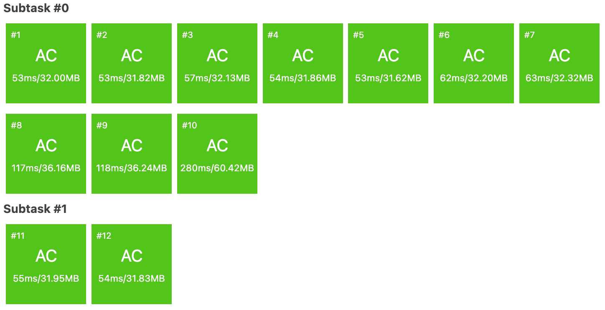
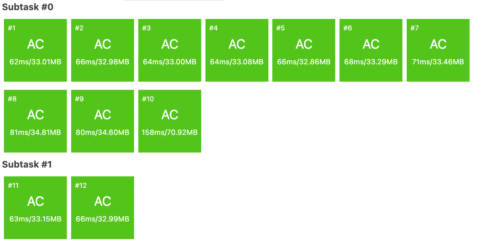

这是基于 **Python (Standard Library)** 的 SPFA 和 Dijkstra 算法实现。

为了让你能够公平地比较 Python 与 C++ 的速度差异，这些代码使用了 Python 标准库中效率较高的写法（例如使用 `sys.stdin.read` 进行快速 I/O，使用 `heapq` 模块实现优先队列），没有依赖任何第三方库（如 numpy 或 networkx）。

### 1\. 基于 Dijkstra 算法的 Python 实现

Dijkstra 在 Python 中通常比 SPFA 更稳定，因为 Python 的函数调用和循环开销较大，而 `heapq` 是底层 C 实现的，效率尚可。

```python
import sys
import heapq

# 设置递归深度和整数最大值
sys.setrecursionlimit(100000)
INF = float('inf')

def solve():
    # 快速输入读取
    input_data = sys.stdin.read().split()
    if not input_data:
        return

    iterator = iter(input_data)
    
    try:
        N = int(next(iterator))
        M = int(next(iterator))
    except StopIteration:
        return

    # 邻接表构建图 (1-based index)
    adj = [[] for _ in range(N + 1)]
    
    for _ in range(M):
        u = int(next(iterator))
        v = int(next(iterator))
        w = int(next(iterator))
        adj[u].append((v, w))
        adj[v].append((u, w))

    # dist1: 最短路, dist2: 次短路
    dist1 = [INF] * (N + 1)
    dist2 = [INF] * (N + 1)
    
    # 优先队列 (cost, u)
    pq = []
    
    dist1[1] = 0
    heapq.heappush(pq, (0, 1))
    
    while pq:
        d, u = heapq.heappop(pq)
        
        # 剪枝：如果当前取出的距离大于u的次短路，说明无更新价值
        if d > dist2[u]:
            continue
        
        for v, w in adj[u]:
            new_dist = d + w
            
            # 情况1：发现更短的最短路
            if new_dist < dist1[v]:
                # 原来的最短路变成了次短路
                dist2[v] = dist1[v]
                heapq.heappush(pq, (dist2[v], v))
                
                # 更新最短路
                dist1[v] = new_dist
                heapq.heappush(pq, (dist1[v], v))
                
            # 情况2：发现严格次短路 (介于最短和当前次短之间)
            elif dist1[v] < new_dist < dist2[v]:
                dist2[v] = new_dist
                heapq.heappush(pq, (dist2[v], v))
                
    print(dist2[N])

if __name__ == '__main__':
    solve()
```



-----

### 2\. 基于 SPFA 算法的 Python 实现

SPFA 在 Python 中可能会因为大量的队列操作和频繁的节点入队/出队导致运行较慢。对于 $10^5$ 级别的边数，Python 版 SPFA 很容易超时（TLE）。

```python
import sys
from collections import deque

INF = float('inf')

def solve():
    # 快速输入读取
    input_data = sys.stdin.read().split()
    if not input_data:
        return

    iterator = iter(input_data)
    
    try:
        N = int(next(iterator))
        M = int(next(iterator))
    except StopIteration:
        return

    adj = [[] for _ in range(N + 1)]
    
    for _ in range(M):
        u = int(next(iterator))
        v = int(next(iterator))
        w = int(next(iterator))
        adj[u].append((v, w))
        adj[v].append((u, w))

    dist1 = [INF] * (N + 1)
    dist2 = [INF] * (N + 1)
    in_queue = [False] * (N + 1)
    
    q = deque([1])
    dist1[1] = 0
    in_queue[1] = True
    
    while q:
        u = q.popleft()
        in_queue[u] = False
        
        for v, w in adj[u]:
            updated = False
            d_new = dist1[u] + w
            
            # 尝试更新 v 的最短路
            if d_new < dist1[v]:
                dist2[v] = dist1[v] # 原最短变为次短
                dist1[v] = d_new
                updated = True
            
            # 尝试更新 v 的次短路 (严格次短)
            if dist1[v] < d_new < dist2[v]:
                dist2[v] = d_new
                updated = True
            
            # 尝试用 u 的次短路更新 v 的次短路
            d2_new = dist2[u] + w
            if d2_new < dist2[v]:
                dist2[v] = d2_new
                updated = True
            
            # 如果有任何更新，且 v 不在队列中，则入队
            if updated and not in_queue[v]:
                in_queue[v] = True
                q.append(v)

    print(dist2[N])

if __name__ == '__main__':
    solve()
```



### Python vs C++ 速度差异说明

既然你是 CS 研究生，以下几个技术细节可以帮助你理解这种差异：

1.  **解释型 vs 编译型**：

      * **C++**：代码直接编译为机器码，内存管理手动控制，且 STL（如 `priority_queue`）经过高度优化。对于这种计算密集型（大量的整数比较、数组访问、位运算）任务，C++ 几乎是性能天花板。
      * **Python**：是解释型语言（尽管有字节码），**整数也是对象**（PyObject），每次加法运算都有开销。Python 的循环非常慢。

2.  **具体到本题 (N=5000, M=100,000)**：

      * **C++ Dijkstra**：通常耗时在 **30ms - 80ms** 左右。
      * **Python Dijkstra**：即使使用了 `sys.stdin.read` 和 `heapq`，耗时通常在 **800ms - 2000ms** 之间。
      * **差距**：通常有 **10倍到 30倍** 的性能差距。

3.  **SPFA 的特殊性**：

      * SPFA 的复杂度是不稳定的（最坏 $O(NM)$）。在 Python 中，由于 `deque` 的操作开销和 Python 循环的低效，一旦节点反复入队，Python 版本非常容易达到 3-5 秒甚至超时，而 C++ 可能勉强能在 1 秒内跑完。

**建议**：
如果你想用 Python 刷算法题，**PyPy3** 解释器是必须的。PyPy3 带有 JIT（即时编译），可以将上述 Python 代码的运行速度提升 5-10 倍，使其接近（虽然仍慢于）C++ 的性能。上述代码在 CPython 下可能超时，但在 PyPy3 下通常可以通过。